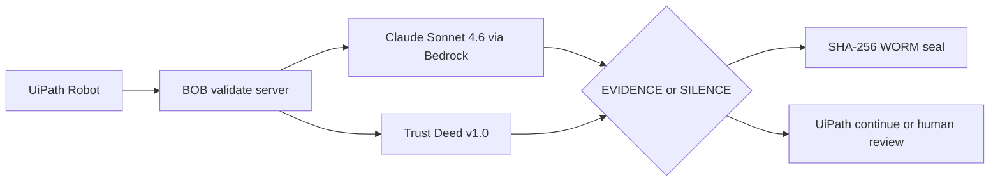

# BOB - UiPath AgentHack 2026 Submission Hub

This repository hosts the public GitHub Pages landing page for:

**BOB - Sovereign Compliance Agent for UiPath**

[](https://snapkittywest.github.io/bob-hackathon-demo/)
[](https://github.com/SNAPKITTYWEST/bob-orchestrator)
[](https://uipath-agenthack.devpost.com/)

## Open

```text
https://snapkittywest.github.io/bob-hackathon-demo/
```

## Files

| File | Purpose |
|---|---|
| `index.html` | Single-file GitHub Pages landing page |
| `DEVPOST_SUBMISSION.md` | Copy/paste Devpost submission text |
| `PRESENTATION_OUTLINE.md` | Hackathon deck outline |

## Source Code

The actual BOB implementation lives here:

```text
https://github.com/SNAPKITTYWEST/bob-orchestrator
```

## What BOB Does



## Submission Checklist

- [x] Public GitHub Pages site
- [x] Public GitHub source repository
- [x] Written project description
- [x] Architecture diagram
- [x] UiPath components listed
- [x] Coding agent usage documented
- [ ] Demo video link added to Devpost
- [ ] Presentation deck link added to Devpost
